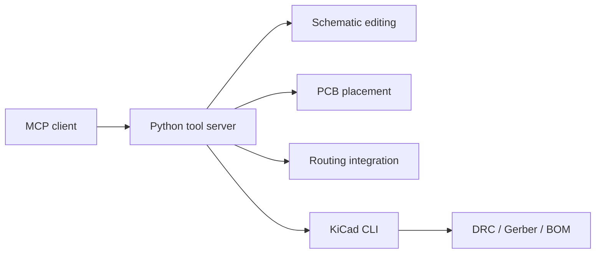

# KiCad MCP Server

### Python tooling for schematic and PCB workflows

A Model Context Protocol (MCP) server that exposes KiCad operations to a compatible assistant such as Claude Desktop. The project explores how software tools can automate repetitive steps in electronics design.

**Stack:** Python · MCP · KiCad file formats · KiCad CLI · Freerouting integration

[Implementation](server.py) · [Detailed documentation](docs/setup.md) · [Example workflow](examples/skin_hydration_example.md)

## Architecture



## Source modules

| Module | Responsibilities |
| :--- | :--- |
| [server.py](server.py) | MCP tool definitions and request dispatch |
| [schematic.py](tools/schematic.py) | Symbols, wires, power symbols, BOM-driven schematic generation |
| [pcb_board.py](tools/pcb_board.py) | Board editing, component placement, traces |
| [router.py](tools/router.py) | Freerouting integration and fallback routing |
| [kicad_cli.py](tools/kicad_cli.py) | KiCad CLI wrappers for checks and exports |

## Intended workflow

1. Create or open a KiCad project.
2. Add components and schematic connections.
3. Place footprints on the board.
4. Route connections and inspect the result.
5. Run design checks and export manufacturing files.

These are source-level capabilities; the repository does not include a fabricated-board demonstration or a published end-to-end validation report.

## Getting started

Clone this repository and consult the [setup guide](docs/setup.md). The implementation and installation scripts live at the repository root. Review the installation script before running it because it modifies local MCP client configuration.

```bash
git clone https://github.com/DooJinWon/kicad-mcp-server.git
cd kicad-mcp-server
```

## Project status

Prototype tooling. Generated schematics and layouts require inspection in KiCad; successful file generation alone does not establish electrical correctness or manufacturability.

## License

See the [MIT license](LICENSE).
